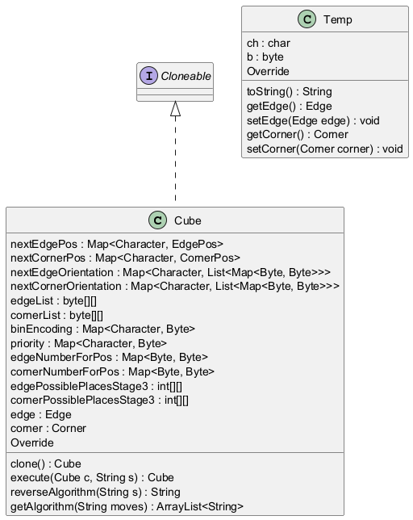

# Generated Documentation with UML
## LLM Output
# Function Documentation
 
This documentation provides detailed explanations for each function listed, maintaining the order of execution based on their dependencies. Each function contributes to manipulating or obtaining properties related to a `Cube` object.
 
## 1. Function `func1`
 
### Description
This function is responsible for creating a new instance of the `Cube` class. It clones the properties of `edge` and `corner` from the current instance to ensure that modifications to the new cube do not affect the original cube.
 
### Body
```java
return new Cube(this.getEdge().clone(), this.getCorner().clone());
```
 
### Dependencies
- `getEdge()`: Must return the current edge state of the cube.
- `getCorner()`: Must return the current corner state of the cube.
 
---
 
## 2. Function `func2`
 
### Description
This function takes a `Cube` object `c` and a string `s` of moves to apply transformations to the cube's configuration. It handles move notations, updates the edge and corner positions and orientations according to predefined transformation maps.
 
### Body
```java
Cube temp = c.clone();
String[] moves = s.split(" ");
if (moves.length > 1) {
    // Builds the string representation of moves.
    StringBuilder sBuilder = new StringBuilder();
    for (String string : moves) {
        // Handle different move lengths.
        if (string.length() == 1)
            sBuilder.append(string.charAt(0));
        else if (string.charAt(1) == '2')
            sBuilder.append(String.valueOf(string.charAt(0)).repeat(2));
        else
            sBuilder.append(String.valueOf(string.charAt(0)).repeat(3));
    }
    s = sBuilder.toString();
}
```
- This part processes the move notation for subsequent applications.
 
```java
for (int i = 0; i < s.length(); i++) {
    char ch = s.charAt(i);
    EdgePos edgePos = temp.getEdge().getEdgePos().clone();
    EdgeOrientation edgeOrientation = temp.getEdge().getEdgeOrientation().clone();
    // Update edge position and orientation.
    for (int j = 0; j < 12; j++) {
        edgeOrientation.setVal(j, nextEdgeOrientation.get(ch).get(edgePos.getVal()[j]).get(edgeOrientation.getVal()[j]));
        edgePos.setVal(j, nextEdgePos.get(ch).getVal()[edgePos.getVal()[j]]);
    }
    temp.setEdge(new Edge(edgePos, edgeOrientation));
    CornerPos cornerPos = temp.getCorner().getCornerPos().clone();
    CornerOrientation cornerOrientation = temp.getCorner().getCornerOrientation().clone();
    // Update corner position and orientation.
    for (int j = 0; j < 8; j++) {
        cornerOrientation.setVal(j, nextCornerOrientation.get(ch).get(cornerPos.getVal()[j]).get(cornerOrientation.getVal()[j]));
        cornerPos.setVal(j, nextCornerPos.get(ch).getVal()[cornerPos.getVal()[j]]);
    }
    temp.setCorner(new Corner(cornerPos, cornerOrientation));
}
return temp;
```
- Each character in the move string applies corresponding rotations to both edges and corners.
 
### Dependencies
- `getEdge()`, `getCorner()`, `setEdge()`, and `setCorner()` must be defined in the `Cube` class.
- The transformation maps: `nextEdgeOrientation`, `nextEdgePos`, `nextCornerOrientation`, and `nextCornerPos` must be pre-defined structures for valid operations on the cube.
 
---
 
## 3. Function `func3`
 
### Description
This function takes a string `s`, repeats each character three times, and then returns the reversed result as a string. It utilizes `StringBuilder` for efficient string manipulation.
 
### Body
```java
StringBuilder result = new StringBuilder();
for (int i = 0; i < s.length(); i++)
    result.append(String.valueOf(s.charAt(i)).repeat(3));
return new StringBuilder(result.toString()).reverse().toString();
```
 
### Dependencies
- `StringBuilder`: This class is used for constructing strings efficiently and requires no external dependencies.
 
---
 
## 4. Function `func4`
 
### Description
This function processes a series of move characters and compresses consecutive duplicates into a specific format (e.g., for moves such as `R` becomes `R`, `RR` becomes `R2`), while ignoring sequences of three or more duplicates.
 
### Body
```java
class Temp {
    final char ch;  // character representing the move
    final byte b;   // count of repetitions
 
    public Temp(char ch, byte b) {
        this.ch = ch;
        this.b = b;
    }
}
Stack<Temp> s = new Stack<>();
ArrayList<String> v = new ArrayList<>(Arrays.asList("", "", "2", "'"));
ArrayList<String> result = new ArrayList<>();
for (int i = 0; i < moves.length(); i++) {
    // Logic to manage moves
    if (s.isEmpty() || s.peek().ch != moves.charAt(i))
        s.push(new Temp(moves.charAt(i), (byte) 1));
    else {
        Temp x = s.pop();
        // Increment count if not already 3
        if (x.b != (byte) 3)
            s.push(new Temp(x.ch, (byte) (x.b + 1)));
    }
}
while (!s.isEmpty()) {
    Temp x = s.pop();
    if (x.b != 0)
        result.add(0, x.ch + v.get(x.b));
}
return result;
```
 
### Dependencies
- Utilizes `Stack` and `ArrayList` for the necessary data structures, with no external dependencies required.
 
---
 
## 5. Function `func5`
 
### Description
This function provides a string representation of the `Cube` object, including its edge and corner states. It formats the output in a structured string format.
 
### Body
```java
return "Cube{\n" + "edge=" + edge.toString() + ",\ncorner=" + corner.toString() + "\n}";
```
 
### Dependencies
- Requires both the `edge` and `corner` objects to have a valid `toString()` method defined, allowing for their string representation.
 
---
 
## 6. Function `func6`
 
### Description
This function returns the current state of the `edge` variable. Typically, this could refer to edges on a Rubik's cube or a similar structure.
 
### Body
```java
return edge;
```
 
### Dependencies
- The variable `edge` must be defined and initialized prior to the function's call.
 
---
 
## 7. Function `func7`
 
### Description
This function sets the `edge` property of the current object. It allows for updates to the edges of the `Cube`.
 
### Body
```java
this.edge = edge;
```
 
### Dependencies
- The `edge` parameter must be provided when calling this function, typically representing the new edge state.
 
---
 
## 8. Function `func8`
 
### Description
This function returns the current state of the `corner` variable. This typically pertains to corners of a structure like a Rubik's cube.
 
### Body
```java
return corner;
```
 
### Dependencies
- The variable `corner` must be defined and initialized prior to the function's call.
 
---
 
## 9. Function `func9`
 
### Description
This function sets the `corner` property of the current object. It allows for updates to the corners of the `Cube`.
 
### Body
```java
this.corner = corner;
```
 
### Dependencies
- The `corner` parameter must be provided when calling this function, typically representing the new corner state.
 
---
 
This documentation encapsulates an overview of function purposes, flows, and dependencies necessary for a comprehensive understanding of how to manipulate cube objects. Each function contributes to managing the properties and behaviors associated with cube configurations, enabling essential operations in applications like a Rubik's Cube solver or simulator.
## UML Diagram

